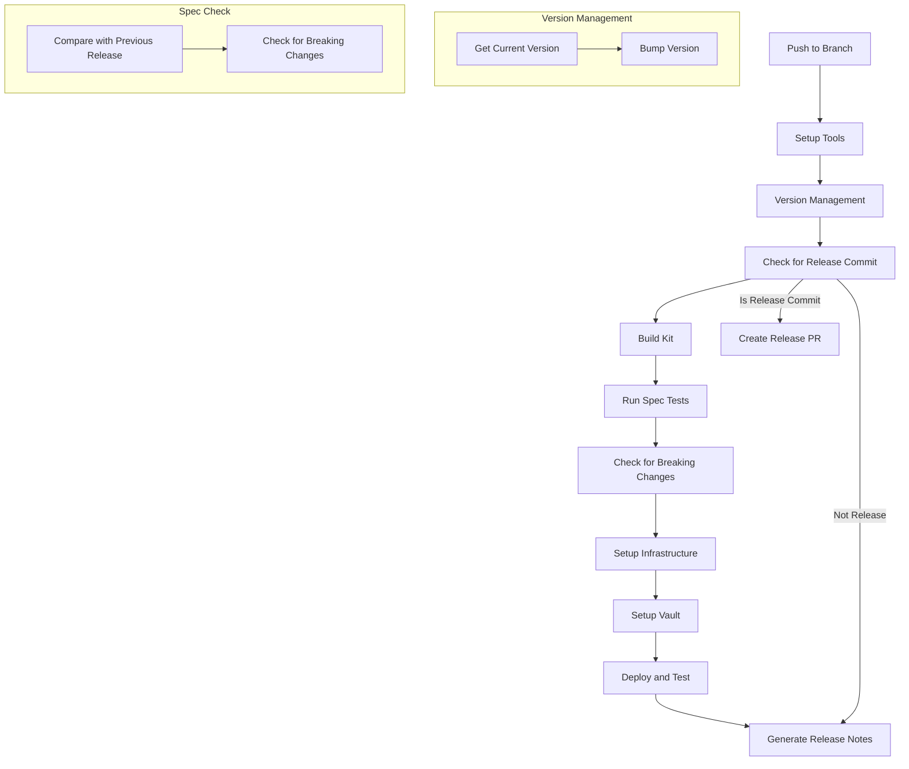
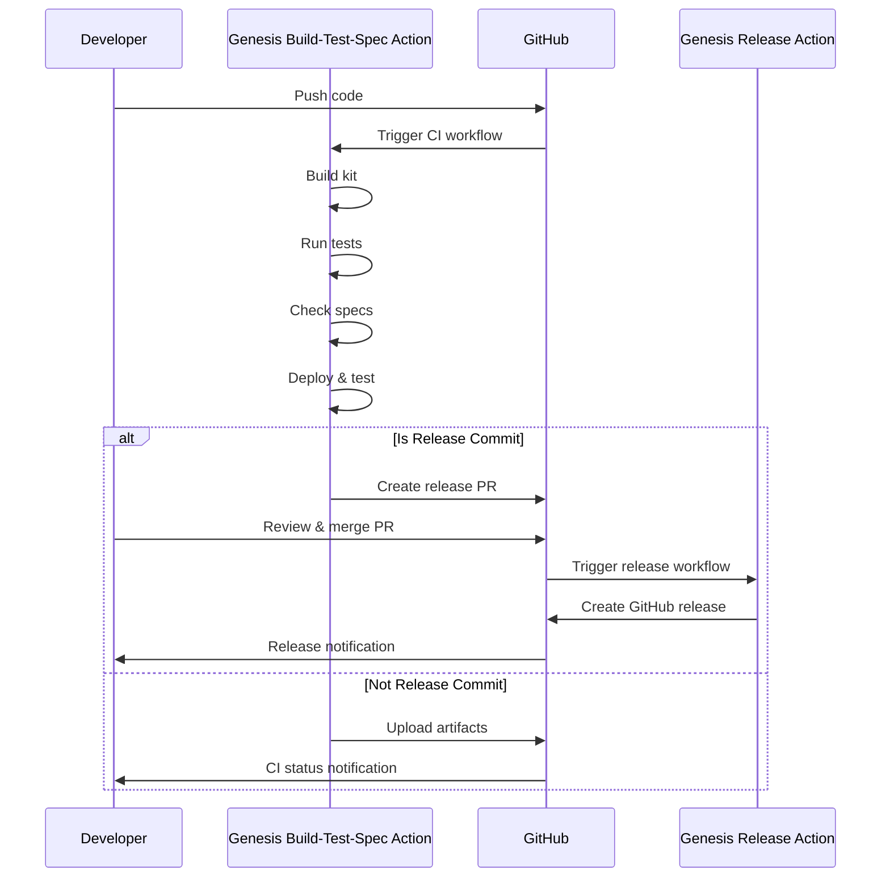

# Genesis Build-Test-Spec Action

This GitHub Action automates the build, test, and spec checking processes for Genesis kits. It provides a comprehensive CI workflow that includes version management, build procedures, test execution, spec checking, deployment verification, and release preparation.

## Overview

The Genesis Build-Test-Spec Action is designed to:

1. Build Genesis kits
2. Run spec tests
3. Check for breaking changes
4. Test deployments
5. Detect release commits and prepare release branches

## Action Workflow



## Key Components

### Version Management

This component handles version tracking and increments according to semantic versioning principles:

- Extracts current version from the kit
- Bumps version according to the specified type (patch, minor, major)
- Updates the version file

### Release Commit Detection

The action automatically detects release commits:

- Analyzes commit messages for release patterns
- Identifies version numbers from the commits
- Flags commits for release processing

### Build Process

The build component compiles the Genesis kit:

- Uses Genesis CLI to compile the kit
- Creates a tarball artifact
- Prepares artifacts for testing and deployment

### Spec Testing

The spec testing component ensures kit functionality:

- Sets up Go environment
- Runs Ginkgo spec tests
- Verifies kit functionality

### Spec Change Detection

This critical component identifies breaking changes:

- Compares specs with the previous release
- Detects changes that might affect users
- Flags breaking changes for release notes

### Deployment Testing

The deployment component verifies operation in a real environment:

- Sets up infrastructure connections
- Configures Vault
- Deploys the kit in a test environment
- Verifies successful operation

### Release Preparation

For release commits, this component:

- Creates a release branch
- Generates comprehensive release notes
- Opens a pull request to the release branch

## Usage

```yaml
- uses: genesis-community/genesis-kit-build-test-spec-action@v1
  with:
    kit_name: shield
    version_bump: patch
    github_token: ${{ secrets.GITHUB_TOKEN }}
    # Additional configuration as needed
```

### Required Inputs

| Name | Description |
|------|-------------|
| `kit_name` | Name of the Genesis kit |
| `github_token` | GitHub token for operations |

### Optional Inputs

| Name | Description | Default |
|------|-------------|---------|
| `version_bump` | Type of version bump (patch, minor, major) | `patch` |
| `go_version` | Go version to use for tests | `go1.23.5.linux-amd64.tar.gz` |
| `ginkgo_params` | Ginkgo test parameters | `-p` |
| `deploy_env` | Deployment environment for testing | `ci-vsphere-baseline` |
| `iaas_provider` | Infrastructure type (vsphere, aws, gcp, etc) | `vsphere` |
| `release_branch` | Branch to create PR against for releases | `main` |

Additional inputs for infrastructure and Genesis/BOSH credentials are also available.

### Outputs

| Name | Description |
|------|-------------|
| `version` | The new version number |
| `previous_version` | The previous version number |
| `has_breaking_changes` | Whether breaking changes were detected |
| `is_release_commit` | Whether the commit message indicates a release |
| `release_version` | Version to release from commit message |

## Integration with Genesis Release Action

This action is designed to work seamlessly with the [Genesis Release Action](https://github.com/genesis-community/genesis-kit-release-action), which handles the actual release process.



## Repository Structure Requirements

To use this action, your Genesis kit repository should have:

```
your-kit-repo/
├── ci/
│   ├── envs/           # Deployment environment files
│   │   ├── ci.yml
│   │   └── ci-vsphere-baseline.yml
├── spec/               # Spec tests
└── version             # Version file
```

## Example CI Workflow

```yaml
name: CI

on:
  push:
    branches: [develop, main, "feature/**"]
  pull_request:
    branches: [develop]
  workflow_dispatch:
    inputs:
      version_bump:
        description: 'Version bump type'
        required: false
        type: choice
        options:
          - patch
          - minor
          - major
        default: 'patch'

jobs:
  build-test:
    runs-on: ubuntu-latest
    outputs:
      version: ${{ steps.build-test.outputs.version }}
      previous_version: ${{ steps.build-test.outputs.previous_version }}
      has_breaking_changes: ${{ steps.build-test.outputs.has_breaking_changes }}
      is_release_commit: ${{ steps.build-test.outputs.is_release_commit }}
      release_version: ${{ steps.build-test.outputs.release_version }}
    steps:
      - uses: actions/checkout@v4
        with:
          fetch-depth: 0
          
      - name: Build, Test & Check Specs
        id: build-test
        uses: genesis-community/genesis-kit-build-test-spec-action@v1
        with:
          kit_name: your-kit-name
          version_bump: ${{ github.event.inputs.version_bump || 'patch' }}
          github_token: ${{ secrets.GITHUB_TOKEN }}
          # Additional configuration
          
      - uses: actions/upload-artifact@v4
        with:
          name: kit-build
          path: build/*.tar.gz
          
      - uses: actions/upload-artifact@v4
        with:
          name: spec-diffs
          path: spec-check/*
          
      - uses: actions/upload-artifact@v4
        with:
          name: release-notes
          path: release-notes/*
```

## License

MIT
